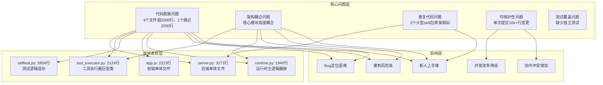
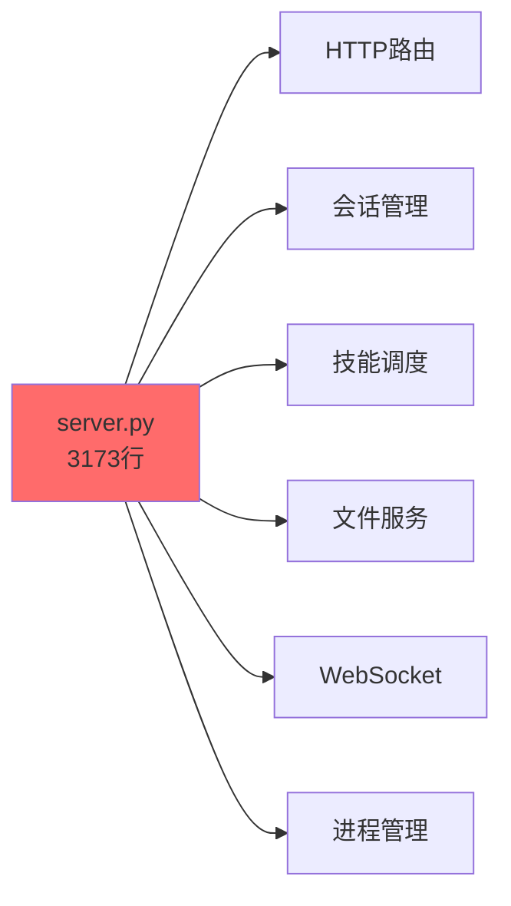
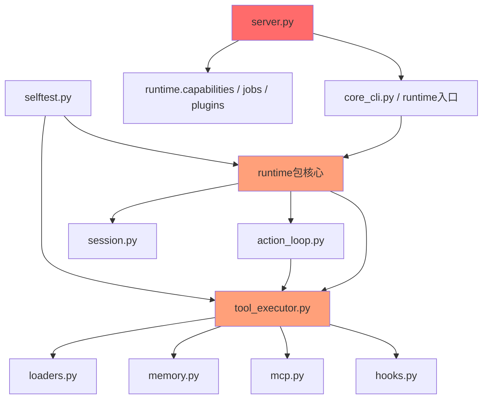
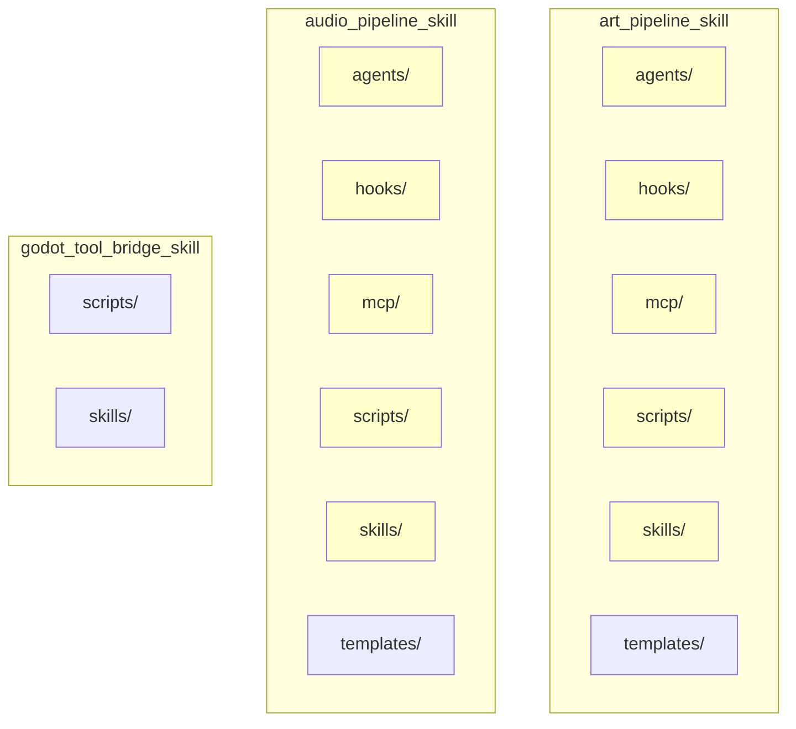
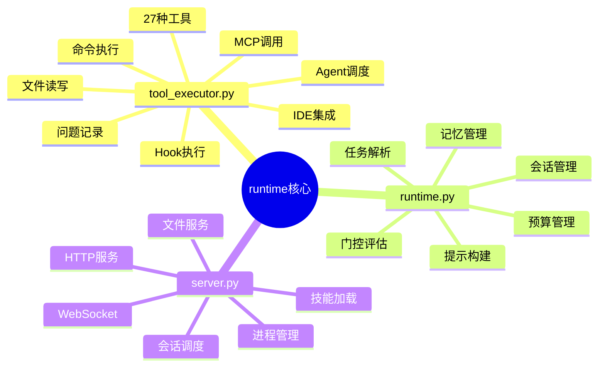
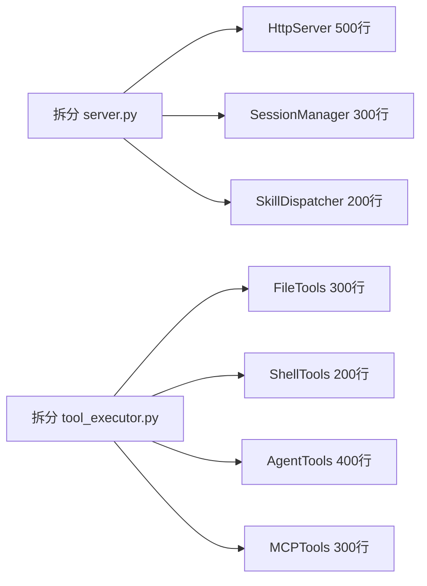
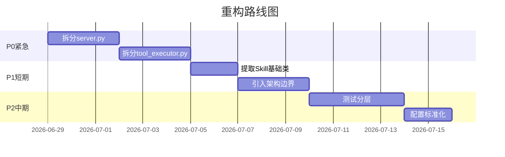

# Claude Code Game Studio 项目问题分析图谱

## 项目概况



## 详细问题清单

### 🔴 严重问题

#### 1. 代码膨胀 - 单文件过大

| 文件 | 行数 | 问题 | 建议阈值 |
|------|------|------|----------|
| `server.py` | 3,173 | HTTP服务器+会话管理+技能调度全混在一起 | <500 |
| `selftest.py` | 2,854 | 测试+验证+断言+报告全部堆叠 | <800 |
| `app.js` | 2,213 | UI组件+状态管理+API调用+渲染逻辑 | <600 |
| `tool_executor.py` | 2,124 | 27个工具执行器+hook+MCP+文件操作 | <800 |
| `runtime.py` | 1,940 | 核心运行时+会话+提示+门控逻辑 | <800 |

**根因**: 未遵循单一职责原则，功能持续堆叠到核心文件。



#### 2. 架构耦合 - 依赖链复杂



**问题**: 
- `tool_executor.py` 被3个核心模块依赖
- `server.py` 主要通过 `core_cli.py` 子进程编排核心执行，并直接引用 `runtime.capabilities/jobs/plugins` 等辅助模块；边界偏厚，但不是直接 import `runtime.py`
- 循环引用风险高

#### 3. 代码重复 - Skill包结构重复



**问题**: `art_pipeline_skill` 和 `audio_pipeline_skill` 的目录骨架高度相似；`godot_tool_bridge_skill` 是更小的桥接 skill。共同问题是共享基础设施不足，而不是三者完全同构。

### 🟡 中等问题

#### 4. 变更规模失控

```
当前工作区 tracked diff 统计（不含未跟踪文件）:
- 35个文件被修改
- +10,335 行增加
- -4,511 行删除
- 净增长: 5,824 行
```

**影响**: 
- 代码审查困难
- 回滚风险高
- 合并冲突概率大

**注**：`git status` 里当前还有未跟踪条目，若把总工作区变更也算上，规模会更大。

#### 5. 模块职责不清



### 🟢 轻微问题

#### 6. 文档与代码不同步
- `README.md` 描述的架构与实际代码结构有偏差
- 配置示例使用 PowerShell，但项目在 macOS 运行

#### 7. 缺少独立测试套件
- `selftest.py` 混合了单元测试、集成测试、验证逻辑
- 没有独立的测试目录结构

## 优先级改进建议

### 立即处理 (P0)



### 短期改进 (P1)

1. **提取 Skill 基础类**
   ```python
   # 新建 codex_skill_runtime_tool/skill_base/
   skill_base/
   ├── __init__.py
   ├── plugin_loader.py    # 共享加载逻辑
   ├── mcp_base.py         # MCP服务器基类
   └── agent_base.py       # Agent基类
   ```

2. **引入架构边界**
   ```
   ui/ (server.py)
     ↓ (通过接口)
   core/runtime/ (runtime.py)
     ↓ (通过接口)
   core/executor/ (tool_executor.py)
   ```

### 中期优化 (P2)

1. **测试分层**
   ```
   tests/
   ├── unit/           # 单元测试
   ├── integration/    # 集成测试
   └── e2e/           # 端到端测试 (现 selftest.py)
   ```

2. **配置管理标准化**
   - 统一配置格式（JSON/TOML/YAML）
   - 配置验证schema
   - 环境变量分离

## 技术债务量化

| 指标 | 当前值 | 目标值 | 差距 |
|------|--------|--------|------|
| 最大文件行数 | 3,173 | 800 | -2,373 ⚠️ |
| 平均文件行数 | 625 | 300 | -325 |
| 模块耦合度 | 高 (8+ 依赖) | 低 (3-4) | 需重构 |
| 代码重复率 | ~15% | <5% | -10% |
| 测试覆盖率 | 未知 | 80% | N/A |

## 重构路线图



## 度量指标

### 复杂度热图

```
高复杂度 █████████░ (90%) server.py
高复杂度 ████████░░ (80%) tool_executor.py
高复杂度 █████████░ (90%) selftest.py
中复杂度 ██████░░░░ (60%) runtime.py
中复杂度 █████░░░░░ (50%) app.js
低复杂度 ███░░░░░░░ (30%) 其他模块
```

### 依赖关系密度

```
runtime.py      ━━━━━━━━━━━━━━━━━━━━ 20+ imports
tool_executor   ━━━━━━━━━━━━━━━━━━━━ 25+ imports
server.py       ━━━━━━━━━━━━━━━ 15+ imports
action_loop     ━━━━━━━━━━ 10+ imports
session         ━━━━━━━ 7+ imports
```

---

**生成时间**: 2026-06-29  
**分析基准**: main 分支, commit 18f68b8  
**代码统计**: 当前快照，建议用 `codex_skill_runtime_tool/scripts/architecture_facts_audit.py` 重新生成后再比较。  
**说明**: 上述数字描述的是这个工作区的瞬时事实，不是永久真值；随着仓库变化，这些数字应由脚本重算。
